# 基于web的人力资源管理系统

#### 介绍

在当今企业管理中，人力资源的有效管理对于组织的发展至关重要。为了提高人力资源管理的效率和准确性，我们开发了这个基于 Web 的人力资源管理系统。该系统旨在为企业提供一个全面、便捷、高效的人力资源管理平台，满足企业对人力资源规划、招聘、培训、绩效管理等方面的需求。

#### 技术栈

后端技术栈：Springboot+Mysql+Maven

前端技术栈：Vue+Html+Css+Javascript+ElementUI

开发工具：Idea+Vscode+Navicate

#### 系统功能介绍

（一）管理员角色  
个人中心：管理员可以在此查看和修改个人的基本信息，包括联系方式、密码等，同时能够查看系统操作日志和接收重要通知。  
基础数据管理：负责维护系统运行所需的基础数据，如职位类别、学历层次、技能类型等，为员工信息的准确录入和管理提供支持。  
员工管理：全面管理员工的基本信息，包括员工的姓名、性别、出生日期、联系方式、入职时间等。可以对员工进行新增、修改、删除操作，还能查看员工的详细履历和工作表现。  
工资管理：设定工资结构和计算规则，如基本工资、绩效工资、津贴、奖金等。能够批量生成员工工资条，处理工资发放和工资调整事宜，同时提供工资报表和统计分析功能。  
人事调配管理：处理员工的岗位调动、晋升、降职等人事变动。可以根据企业的战略和员工的绩效表现，制定合理的人事调配计划，并跟踪调配后的效果。  
部门管理：创建、修改和删除企业的部门结构，为部门分配职责和权限，管理部门间的协作关系，以及查看部门的人员配置和工作负荷情况。  
应聘记录管理：查看和管理求职者的应聘信息，包括简历、面试评价、录用结果等。可以对应聘流程进行跟踪和分析，优化招聘流程和提高招聘效率。  
招聘信息管理：发布企业的招聘职位信息，包括职位描述、任职要求、招聘人数等。能够管理招聘渠道，筛选简历，安排面试等招聘相关工作。  

（二）员工角色  
个人中心：员工可以在此修改个人资料，如联系方式、紧急联系人等，查看自己的工作履历和培训记录。  
工资管理：查看自己的工资明细和发放记录，了解工资构成和扣除项目。  
人事调配管理：查看自己的岗位调动记录和晋升情况，提交岗位调动申请。  
部门管理：了解所在部门的职责和架构，查看部门同事的信息。  

#### 系统作用

人力资源管理系统的主要作用包括：  

提升管理效率： 为管理员提供全面的管理工具，帮助高效管理员工信息、工资、人事调配、部门信息和招聘信息，确保信息的准确性和及时性。  
优化人力资源配置： 通过系统化的人事调配和员工管理，帮助企业更好地分配和利用人力资源，提升工作效率和员工满意度。  
促进信息透明化： 提供便捷的查询和管理功能，使员工可以随时查看个人信息、工资和人事调配记录，提升信息透明度。  
简化招聘流程： 通过招聘信息管理和应聘记录管理，简化招聘流程，提高招聘效率和成功率。  

#### 系统功能截图

代码结构

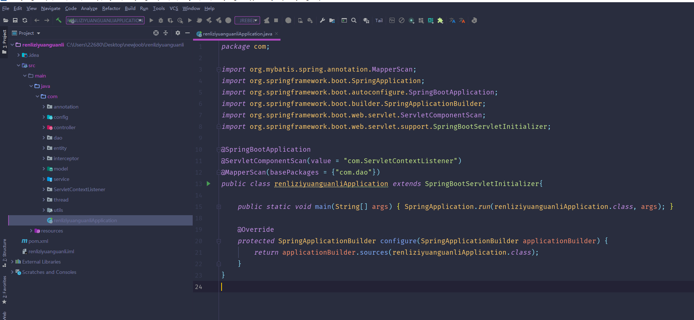

数据库表

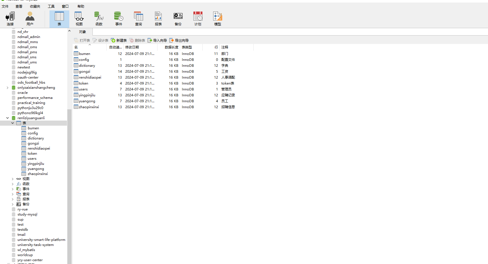

登录

员工端个人信息

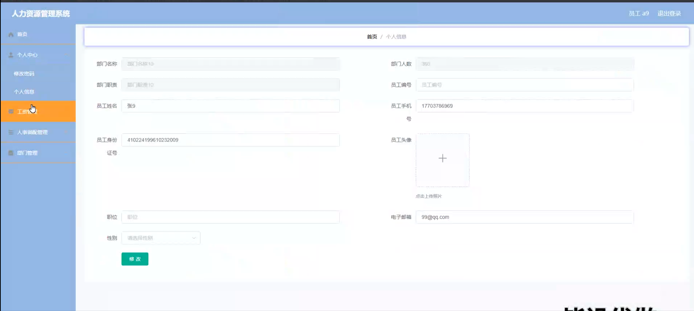

工资管理

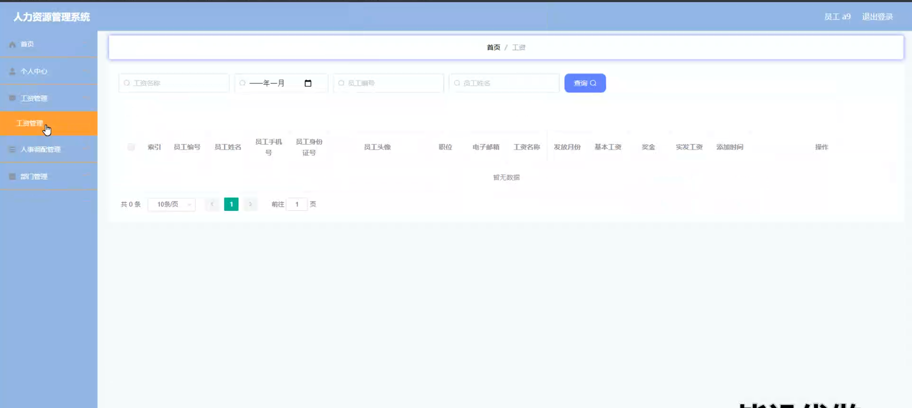

人事调配管理

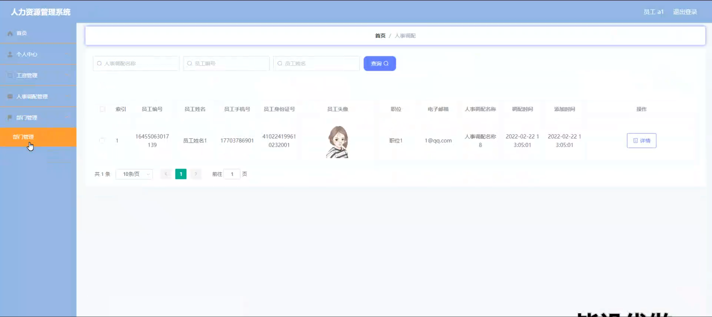

部门管理

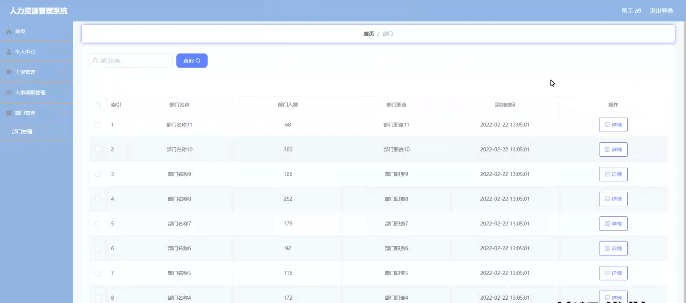

管理员端招聘类型管理

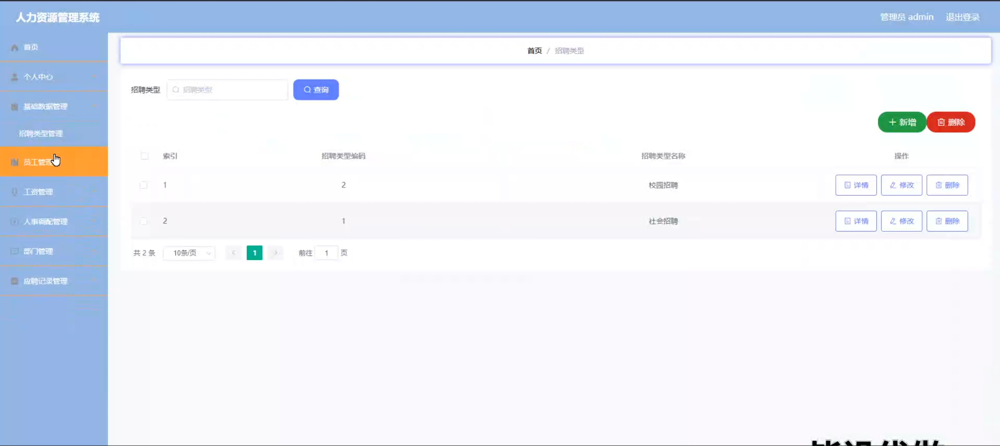

员工管理

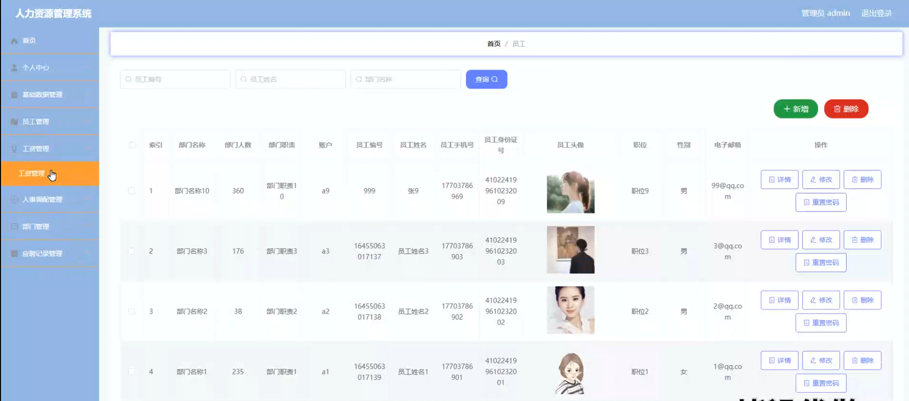

人事调配详细信息

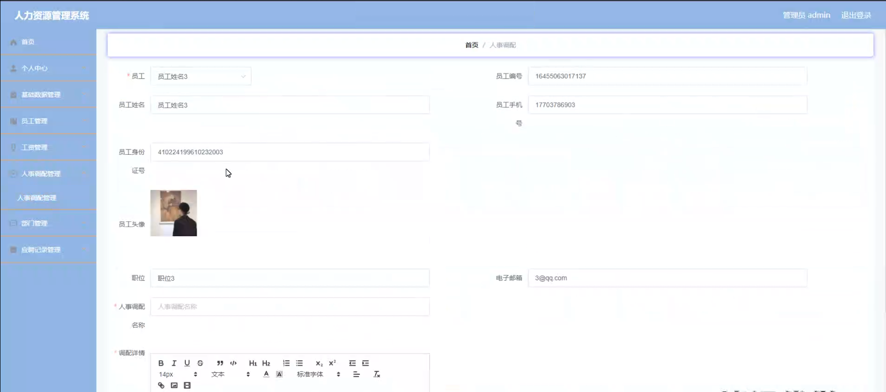

应聘记录管理

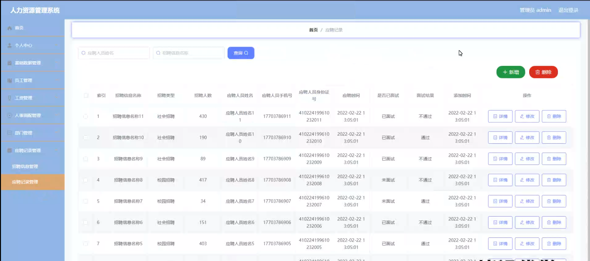

招聘信息管理

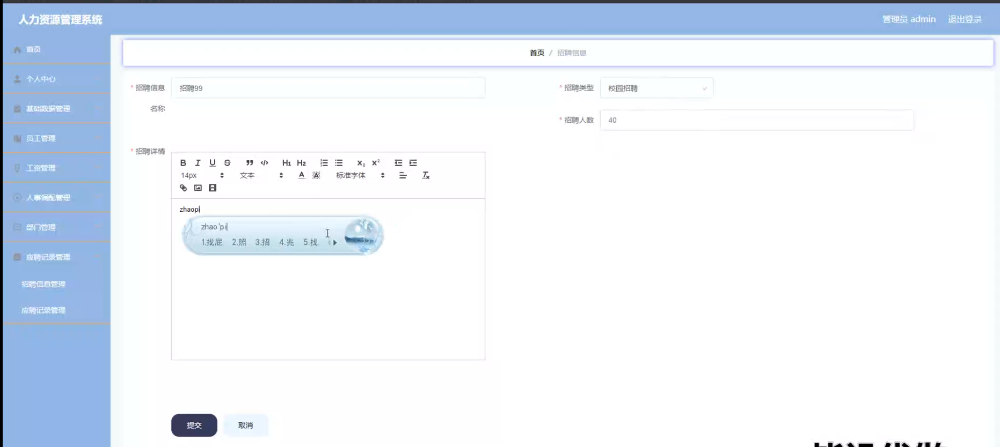

#### 总结

基于 Web 的人力资源管理系统通过明确的角色划分和丰富的功能模块，为企业的人力资源管理提供了全面的解决方案。管理员能够高效地管理企业的人力资源事务，员工能够便捷地获取与自身相关的信息和服务。该系统有助于提升企业的人力资源管理水平，促进企业的持续发展和竞争力提升。

#### 使用说明

创建数据库，执行数据库脚本 修改jdbc数据库连接参数 下载安装maven依赖jar 启动idea中的springboot项目

后台登录页面
http://localhost:8080/renliziyuanguanli/admin/dist/index.html

管理员			账户:admin 	密码：admin
员工				账户:a1 		密码：123456
员工				账户:a2 		密码：123456
员工				账户:a3 		密码：123456